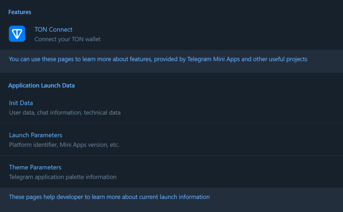

# NUSC QBot Telegram Mini Apps

## Install Dependencies

```Bash
npm install
```

## Scripts

This project contains the following scripts:

- `dev`. Runs the application in development mode.
- `dev:https`. Runs the application in development mode using locally created valid SSL-certificates.
- `build`. Builds the application for production.
- `lint`. Runs [eslint](https://eslint.org/) to ensure the code quality meets
  the required standards.


To run a script, use the `npm run` command:

```Bash
npm run {script}
# Example: npm run build
```

## Run

Although Mini Apps are designed to be opened
within [Telegram applications](https://docs.telegram-mini-apps.com/platform/about#supported-applications),
you can still develop and test them outside of Telegram during the development
process.

To run the application in the development mode, use the `dev` script:

```bash
npm run dev:https
```

> [!NOTE]
> As long as we use [vite-plugin-mkcert](https://www.npmjs.com/package/vite-plugin-mkcert),
> launching the dev mode for the first time, you may see sudo password request.
> The plugin requires it to properly configure SSL-certificates. To disable the plugin, use the `npm run dev` command.

After this, you will see a similar message in your terminal:

```bash
VITE v5.2.12  ready in 237 ms

➜  Local:   https://localhost:5173/reactjs-template
➜  Network: https://172.18.16.1:5173/reactjs-template
➜  Network: https://172.19.32.1:5173/reactjs-template
➜  Network: https://192.168.0.171:5173/reactjs-template
➜  press h + enter to show help
```

Here, you can see the `Local` link, available locally, and `Network` links
accessible to all devices in the same network with the current device.



It is important to note that some libraries in this template, such as
`@tma.js/sdk`, are not intended for use outside of Telegram.

Nevertheless, they appear to function properly. This is because the
`src/mockEnv.ts` file, which is imported in the application's entry point (
`src/index.ts`), employs the `mockTelegramEnv` function to simulate the Telegram
environment. This trick convinces the application that it is running in a
Telegram-based environment. Therefore, be cautious not to use this function in
production mode unless you fully understand its implications.

> [!WARNING]
> Because we are using self-signed SSL certificates, the Android and iOS
> Telegram applications will not be able to display the application. These
> operating systems enforce stricter security measures, preventing the Mini App
> from loading. To address this issue, refer to
> [this guide](https://docs.telegram-mini-apps.com/platform/getting-app-link#remote).

## Useful Links

- [Platform documentation](https://docs.telegram-mini-apps.com/)
- [@tma.js/sdk-react documentation](https://docs.telegram-mini-apps.com/packages/tma-js-sdk-react)
- [Telegram developers community chat](https://t.me/devs_cis)
